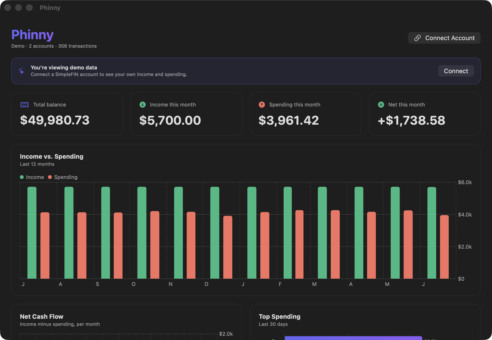

<div align="center">
  
  <h1>Phinny</h1>
  <p><b>An unofficial <a href="https://simplefin.org">SimpleFIN</a> finance tool: a native macOS app <i>and</i> a headless CLI.</b><br/>Syncs your bank data and shows your income &amp; spending in beautiful native charts, backed by a Go engine any agent can drive.</p>
</div>

---

## Why I built this

I wanted to see my own finances clearly, and nothing out there fit:

- **The pricing is backwards.** Most personal-finance apps run about $200 a year. SimpleFIN is $15, and that one connection works with any app that speaks the protocol. You pay for the bank link, not a walled garden.
- **My data should be local.** Other apps keep your transactions in their cloud. Phinny syncs everything to a plain local SQLite file, so an AI agent on your own machine can read it directly.
- **Transfers and mortgages are handled badly elsewhere.** I never liked apps double-counting transfers between my own accounts, or making me log every mortgage payment. Phinny detects transfers on its own and computes the whole mortgage from the loan terms.
- **Awareness beats budgeting.** Just seeing what I earn and spend changes my behavior more than any budget envelope. Phinny shows you that plainly instead of asking you to manage a budget.

## What it does

- **Connect once** with a SimpleFIN setup token, or try the built-in demo.
- **Syncs on launch**, but only when the data is stale, to respect SimpleFIN's ~24 requests/day budget.
- **Charts** income vs. spending, net cash flow, top spending, and recent transactions with native [Swift Charts](https://developer.apple.com/documentation/charts).
- **Tracks mortgages** without logging every payment: enter the loan, rate, and down payment, and Phinny computes the amortization, equity, and payoff. Adjust the rate and home value over time, add extra principal, and link a real payment.
- **Categorizes spending** into your own categories: tag any transaction and the Top Spending chart groups by them. Manual tags are flagged so a future auto-categorizer never overwrites them.
- **Detects transfers** between your own accounts and keeps them out of your income and spending totals. Mark anything as a transfer (or not) and your choice always wins.
- **Imports Apple Card** statements SimpleFIN can't reach (CSV/OFX/QFX/QBO exported from the iPhone Wallet app), and runs on Apple Card alone if that's all you have.
- **Keeps everything local**: SQLite in `~/.phinny`, credentials in the macOS Keychain. Nothing leaves your machine but the SimpleFIN request itself.

<div align="center"></div>

## App or CLI, same engine

Phinny is two things over one engine and one local database (`~/.phinny/phinny.sqlite`):

- **The macOS app** - the native SwiftUI dashboard above.
- **The `phinny` CLI** - the same engine, headless. Every feature (sync, categorize, transfers, Apple Card import, mortgage math, Zillow) is a subcommand or JSON-RPC method, so an agent or a script can drive your finances directly. The app is a thin wrapper that launches `phinny serve --stdio` and talks to it over a pipe.

Install the CLI with Go:

```bash
go install github.com/RomneyDa/phinny/cli/cmd/phinny@latest
phinny --demo --demo-source Resources/phinny-demo.sqlite status   # safe demo, no network
```

Full command reference: [`cli/README.md`](cli/README.md). Agents can install the [Phinny CLI skill](skills/phinny-cli/SKILL.md) (Agent Skills format) to learn the surface.

---

The rest is for the curious and for anyone who wants to build it.

## The sync budget (important)

SimpleFIN allows roughly **24 requests per day**. Phinny is careful with them:

- The **claim** step runs once per token. The resulting access URL is reused forever, so connecting again costs nothing.
- Only `GET /accounts` counts against the budget.
- On launch, Phinny auto-syncs **only if** there's no data yet or the last sync is older than `min_interval_hours` (default 6). Relaunching repeatedly will not burn requests.
- "Sync Now" (⌘R) is always available for a manual refresh.

While developing, just use **demo mode** (the default), which reads bundled sample data and never touches your real account's budget.

## Building & contributing

Build and run instructions, release and signing, the docs site, and the conventions and architecture map for coding agents all live in [`AGENTS.md`](AGENTS.md).

## License

© 2026 Dallin Romney.
